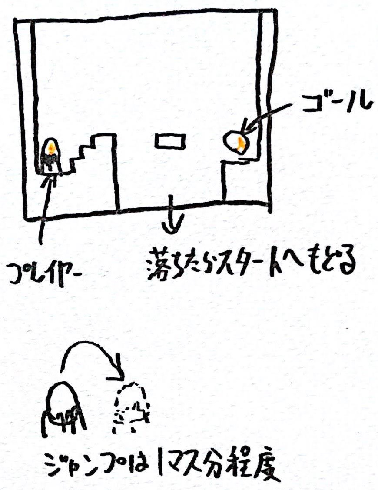

# 移動床
移動床にプレイヤーが乗って移動するシチュエーションを作成する雛形プロジェクト。

[デモ](https://am1tanaka.github.io/TaikenMoveFloor/Demo/)

## 動作環境
- Unity2021.3.4f1
- 解像度 960x540

## 企画

- 矢印左右か[A][D]で左右移動
- スペースキーでジャンプ
- ジャンプは2～4マス程度。重力を4倍ぐらいにするとよい
- 落下するか、ゴールに触れるとスタート地点に戻る
- 真ん中のMoveFloorを左右に移動させることで、乗ってゴールできるようにする
